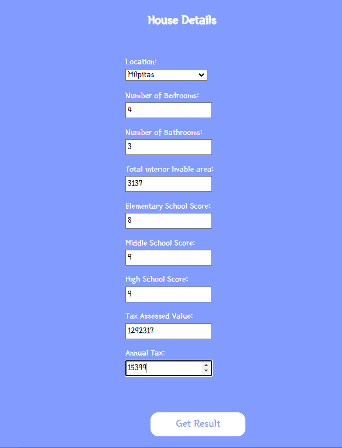
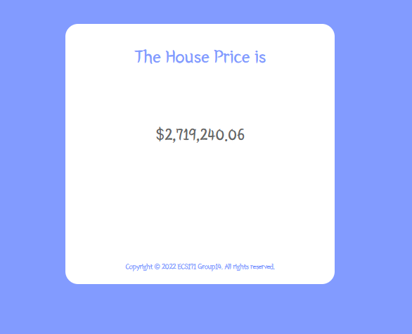

# ECS-171-machine-learning-project

## Preview

## Introduction
Our goal for this project is to predict how much a Single-Family home will be listed for. 
## Dataset
[CA Dateset](https://www.kaggle.com/competitions/california-house-prices/overview)

## Application
Link to website [Project Website](https://ecs-171-project.herokuapp.com/). Cannot run locally without access to API key for OpenCage

### Frontend
There are two folder for the frontend
- **web_frontend** folder is the plain HTML, CSS, and JavaScript/jQuery
- **template** almost identical to the code in **web_frontend** but with Jinja2 syntax.
**Static** folder is where Flask looks for CSS, JS, and Images for the HTML.
### Backend
**app.py** is the code for the API and **cities.py** is the code to convert City name into Latitude and Longitude.

### Data
**Data** folder is where the csv files for the dataset is located and where the code for preproccessing the original dataset is.
